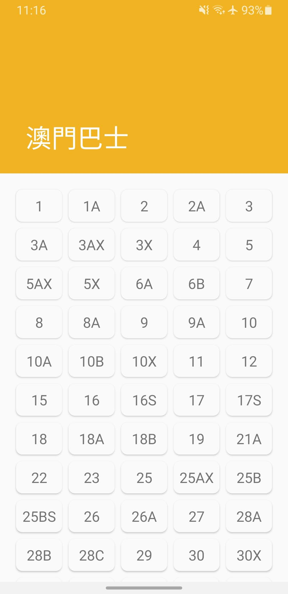
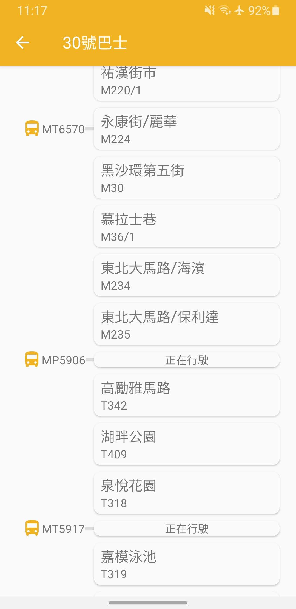
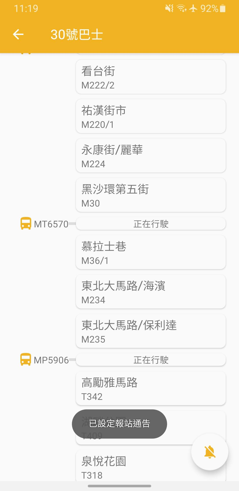
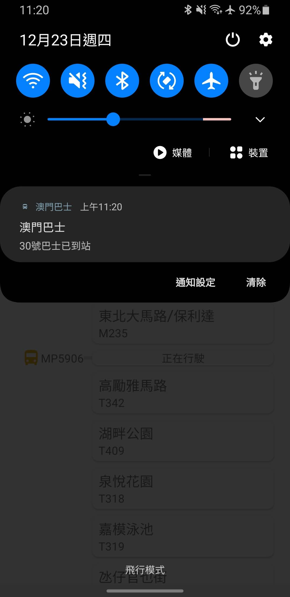

# MacauBus
## This is the first application I built after learning Android programming. Taking Macau's "bus travel system" as a reference, to built a similar app for me to enhance my Android programming knowledge.
### Ref application : https://play.google.com/store/apps/details?id=mo.gov.dsat.bis

* Application Id: com.danielchwh.macaubus
* Min Sdk Version: 19
* Target Sdk Version: 29
* Programming Lanuage: Java

 
<em>Home screen</em>

 
<em>Query bus route</em>

 
<em>Set notification</em>

 
<em>Receive notification</em>
